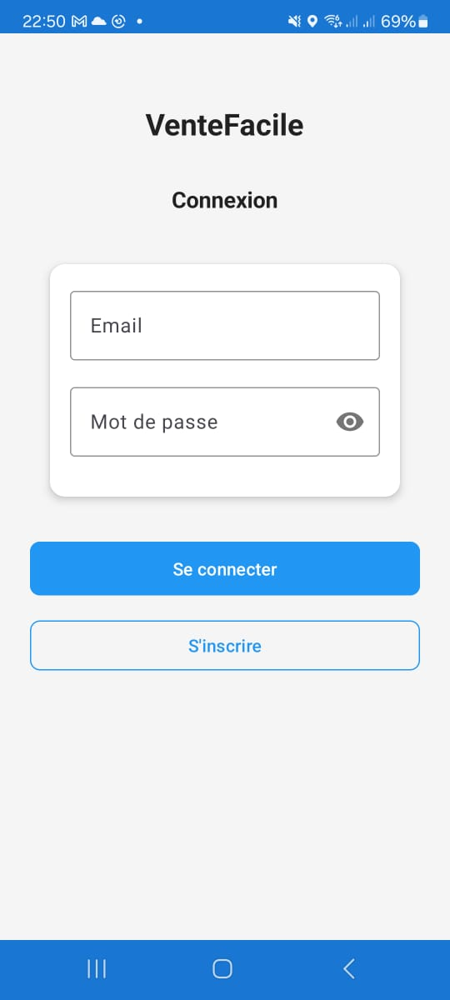
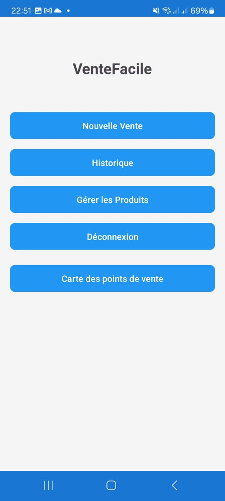
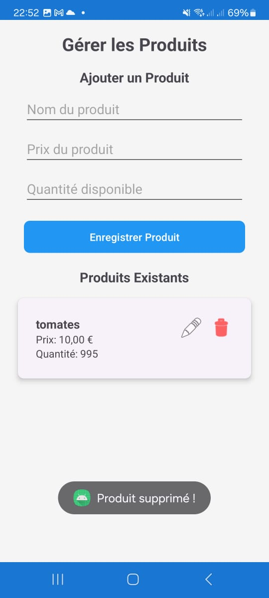
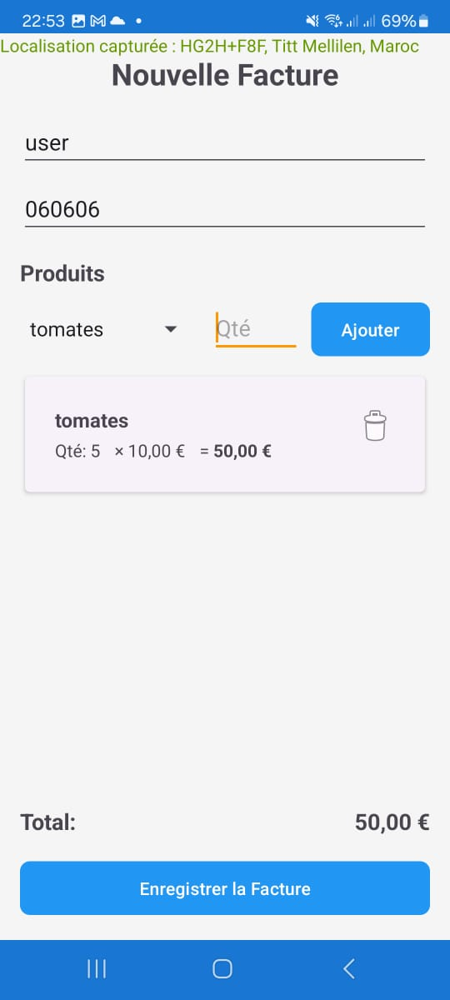
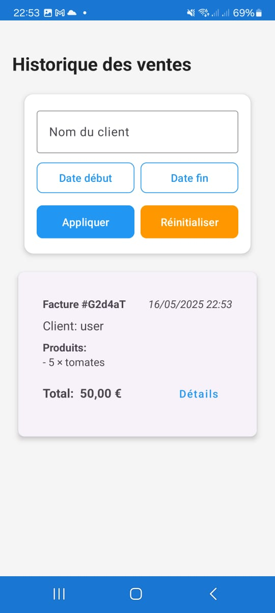
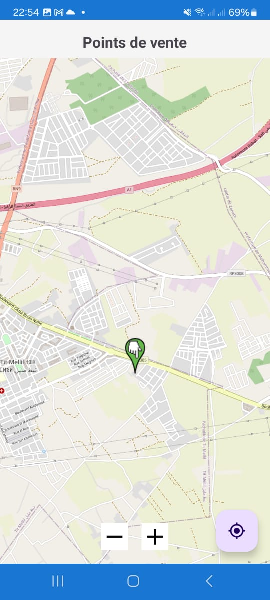

# VenteFacile

Application Android pour gérer facilement vos ventes, produits et factures.

## 📱 À propos de l'application

VenteFacile est une solution mobile complète destinée aux commerçants et entrepreneurs qui souhaitent gérer leurs ventes quotidiennes. L'application permet de gérer l'inventaire des produits, créer des factures, suivre l'historique des ventes et visualiser les points de vente sur une carte.

## ✨ Fonctionnalités principales

- **Gestion des produits**: Ajout, modification et suppression de produits avec suivi des stocks
- **Création de factures**: Interface intuitive pour créer des factures avec plusieurs produits
- **Historique des ventes**: Visualisation et filtrage de l'historique des transactions
- **Carte des ventes**: Visualisation géographique des points de vente avec OpenStreetMap
- **Authentification**: Système de connexion et d'inscription sécurisé avec Firebase
- **Enregistrement des données**: Stockage des données sur Firebase Realtime Database

## 📸 Captures d'écran

<div align="center">
  <table>
    <tr>
      <td align="center"><b>Écran de connexion</b></td>
      <td align="center"><b>Tableau de bord principal</b></td>
      <td align="center"><b>Gestion des produits</b></td>
    </tr>
    <tr>
      <td></td>
      <td></td>
      <td></td>
    </tr>
    <tr>
      <td align="center"><b>Création de facture</b></td>
      <td align="center"><b>Historique des ventes</b></td>
      <td align="center"><b>Carte des ventes</b></td>
    </tr>
    <tr>
      <td></td>
      <td></td>
      <td></td>
    </tr>
  </table>
</div>

## 🛠️ Technologies utilisées

- Java
- Firebase (Authentication, Realtime Database)
- OpenStreetMap pour la cartographie
- Material Design Components
- ViewBinding pour l'interface utilisateur

## 📋 Prérequis

- Android Studio
- Android SDK 21 ou supérieur
- Compte Firebase
- Connexion Internet pour l'utilisation complète des fonctionnalités

## 🚀 Installation

1. Clonez ce dépôt
```bash
git clone https://github.com/salaheddine-ait/ventefacile.git
```

2. Ouvrez le projet dans Android Studio

3. Connectez l'application à votre projet Firebase :
   - Créez un projet dans la console Firebase
   - Ajoutez une application Android avec le package `com.example.projetandroid`
   - Téléchargez le fichier `google-services.json` et placez-le dans le dossier `app/`
   - Synchronisez le projet avec Gradle

4. Exécutez l'application sur un émulateur ou un appareil physique

## 📊 Structure du projet

```
app/
├── java/
│   └── com/
│       └── example/
│           └── projetandroid/
│               ├── adapters/    # Adaptateurs pour RecyclerViews
│               ├── model/       # Classes de modèle de données (Product, Invoice, etc.)
│               ├── view/        # Activités et fragments pour l'interface utilisateur
│               └── utils/       # Classes utilitaires
└── res/
    ├── layout/                  # Fichiers de mise en page XML
    ├── drawable/                # Images et icônes
    ├── values/                  # Chaînes, dimensions, couleurs, styles
    └── ...
```

## 📝 Todo

- [ ] Ajouter des statistiques et des graphiques
- [ ] Implémenter la génération de rapports PDF
- [ ] Ajouter le support pour les paiements en ligne
- [ ] Synchronisation hors ligne


## 👤 Auteur

**SALAHEDDINE AIT EL MAHJOUB**
- GitHub: [@salaheddine-ait](https://github.com/salaheddine-ait)
- LinkedIn: [Salaheddine Ait El Mahjoub](https://www.linkedin.com/in/salaheddine-ait-el-mahjoub/)

---

